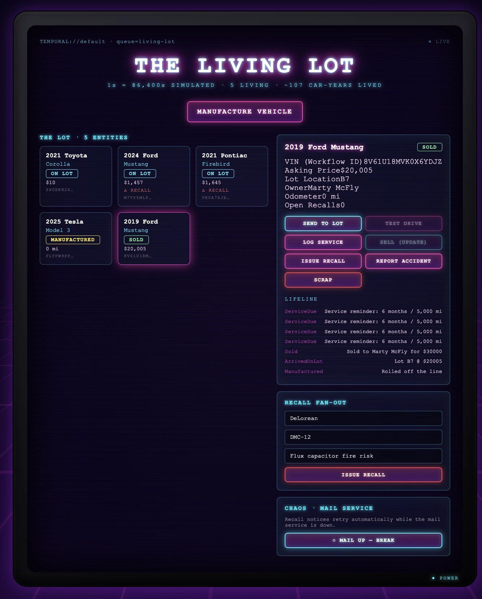
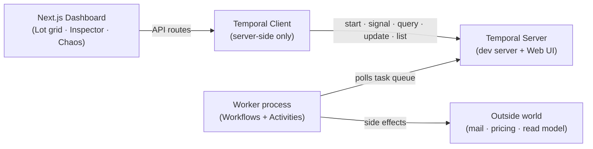

# Temporal Night Drive

### A neon-lit Temporal demo where every car on the lot is a program that lives as long as the car does

<p align="center">
  
</p>

<p align="center">
  <em>Lot dashboard → <code>localhost:3000</code> &nbsp;•&nbsp; Temporal Web UI → <code>localhost:8233</code></em>
</p>

Each vehicle on the dealership lot is a single **Temporal Workflow** — started the
moment the car is built and still running years later through every test drive,
sale, service visit, recall, and trade‑in, ending only when the car is physically
scrapped.

> **The inversion:** In the normal model a request runs, returns, and dies, and
> whatever mattered gets flattened into a database row. Here, **the program _is_
> the thing.** It starts when the car comes into existence, holds its own state in
> memory durably, answers messages for years, and ends only when the car does.
> There is no separate "save the leftovers" step, because the program never leaves.

---

## What it demonstrates

| Concept | How it shows up |
| --- | --- |
| **Entity Workflow** | One running `vehicleLifecycle` execution per VIN — the Workflow ID *is* the VIN, addressable by name forever. |
| **Durable timers** | A car can `sleep` for "three years" (warranty), auto‑drop its price after days on the lot, and wake up on time. |
| **Signals / Queries / Updates** | Fire‑and‑forget commands, read‑only snapshots, and a request/response **sale Update with a validator**. |
| **Consistency boundary** | The car *itself* refuses an illegal sale (recalled / not on lot / below floor). The rule lives with the thing it protects. |
| **Entity composition** | A financed sale spawns a **child `autoLoan`** entity that runs its own 60‑month life alongside the car. |
| **Fleet fan‑out** | A recall is a *population* query — one command signals every matching living car at once via the Visibility API. |
| **Crash‑proof by construction** | Kill the worker mid‑demo; the entity's state is durable in Temporal and simply resumes on restart. |

---

## Architecture



**In one line:** Dashboard → Temporal Client → Temporal Server ← Worker (your
Workflows + Activities) → the outside world.

The Workflows are the **stable spine** (deterministic, replayable). Everything
that touches the outside world is quarantined in **Activities** — the volatile
parts you're free to change.

---

## Prerequisites

- **Node.js 20+** (developed on Node 22)
- **Docker** (runs the single‑container Temporal dev server, which bundles the Web UI)

---

## Quick start

Clone, install, and copy the environment defaults:

```bash
npm install
cp .env.example .env
```

Then run the three pieces, **each in its own terminal** (keeping the worker and
server visible is part of the fun — that's the crash/restart beat):

```bash
# 1) Temporal server + Web UI  (gRPC :7233, UI :8233)
npm run temporal

# 2) The worker — your Workflows + Activities. Kill & restart it anytime.
npm run worker

# 3) The dashboard  (:3000)
npm run dev
```

Open **http://localhost:3000** for the lot and **http://localhost:8233** for the
raw Temporal Web UI. Put them side by side — the dashboard and the event history
are two views of the *same* living entities.

### Seed a lived‑in lot (optional but recommended)

With the server and worker running, populate the lot with a hero **DeLorean** and
a varied fleet (on lot, sold, financed, recalled, scrapped):

```bash
npm run seed
```

> The worker **self‑heals** the custom Search Attributes the dashboard queries on
> (`Make`, `Model`, `Status`, …), registering any that are missing on startup — so
> the lot works no matter how the Temporal server was launched.

---

## Using the dashboard

The dashboard is a **window into a population of running entities** — the grid
isn't `SELECT * FROM cars`, it's a Visibility query over live Workflows.

1. **Manufacture** a car → a new `vehicleLifecycle` entity is born.
2. Click a card to open the **Inspector**: live state, the full action surface, the
   child loan panel, and a scrolling **Lifeline** (the car's auto‑generated history).
3. **Send to Lot**, then **Sell** — financed sales spawn a child `autoLoan`.
4. **Issue a recall** by make/model to fan out to every matching living car at once;
   recalled cars refuse to sell.
5. Flip the **Chaos** panel to break the mail service and watch `sendRecallNotice`
   retry, then heal.

> **The sale is the "oh" moment.** Try selling a car that isn't on the lot, or
> one under recall — the entity rejects it at the door with the *real* reason
> (e.g. *"Cannot sell a vehicle under open recall"*), because the Update's
> validator is the consistency boundary.

---

## Time compression

Temporal sleeps are real wall‑clock by default. So the demo can show *years* in
seconds, every durable sleep is written as `realDuration / DEMO_TIME_SCALE`. The
default `DEMO_TIME_SCALE=86400` means **one simulated day per real second** — the
entity is genuinely running on a real timer; only the wall‑clock span changed.

---

## Scripts

| Command | What it does |
| --- | --- |
| `npm run temporal` | Start the Temporal dev server + Web UI via Docker Compose. |
| `npm run temporal:down` | Stop and remove the Temporal container. |
| `npm run worker` | Run the Worker (Workflows + Activities) with hot reload. |
| `npm run dev` | Start the Next.js dashboard. |
| `npm run build` / `npm run start` | Production build / serve. |
| `npm run seed` | Populate the lot with a hero DeLorean and a varied fleet. |
| `npm run test:replay` | Drive a full lifecycle, then replay its history to assert determinism. |
| `npm run test:sale-error` | Unit test for the sale rejection‑reason unwrapping. |

---

## Configuration

All optional — sensible defaults live in `.env.example`.

| Variable | Default | Purpose |
| --- | --- | --- |
| `TEMPORAL_ADDRESS` | `localhost:7233` | Temporal gRPC endpoint (Worker + server client). |
| `TEMPORAL_NAMESPACE` | `default` | Temporal namespace. |
| `TEMPORAL_TASK_QUEUE` | `living-lot` | Task queue the Worker polls. |
| `DEMO_TIME_SCALE` | `86400` | Simulated‑time factor (days per real second). |

---

## Project structure

```
src/
├─ app/                  # Next.js app router
│  ├─ api/               # Server-side routes → Temporal Client
│  │  ├─ vehicles/       # spawn · [vin] snapshot · signal · sale · loan
│  │  ├─ lot/            # the Visibility query that drives the grid
│  │  ├─ recall/         # fleet-wide recall fan-out
│  │  └─ chaos/mail/     # break/heal the mail Activity
│  └─ page.tsx           # dashboard: grid + inspector + panels
├─ components/           # LotGrid · Inspector · SidePanels
├─ lib/                  # browser fetch helpers · server Temporal client
└─ temporal/             # the heart of the demo
   ├─ vehicle.workflow.ts  # the vehicleLifecycle entity
   ├─ loan.workflow.ts     # the child autoLoan entity
   ├─ vehicle-timers.ts    # price-drop / warranty / service loops
   ├─ activities.ts        # side effects (mail, pricing, read model)
   ├─ search-attributes.ts # typed Search Attributes for the lot query
   └─ worker.ts            # the standalone Worker process
scripts/                 # seed + replay/unit tests
```

---

## HTTP API

The dashboard talks to Temporal only through these server‑side routes (the browser
never holds a Temporal connection):

| Method & path | Action |
| --- | --- |
| `POST /api/vehicles/spawn` | Manufacture a car (start a `vehicleLifecycle`). |
| `GET /api/vehicles/:vin` | `getSnapshot` query for one car. |
| `POST /api/vehicles/:vin/signal` | Fire a signal (`arriveOnLot`, `recordTestDrive`, `issueRecall`, …). |
| `POST /api/vehicles/:vin/sale` | `requestSale` Update — validated, returns `422` with the real reason if rejected. |
| `GET /api/vehicles/:vin/loan` | Snapshot of the child `autoLoan`, if financed. |
| `POST /api/vehicles/:vin/loan/pay` | Make a loan payment. |
| `GET /api/lot` | The Visibility query powering the grid. |
| `POST /api/recall` | Fan a recall out to every matching living car. |
| `GET` / `POST /api/chaos/mail` | Read / toggle the broken‑mail chaos switch. |

---

## Troubleshooting

- **Manufacturing seems to do nothing / the lot stays empty.** The Worker registers
  the custom Search Attributes on startup; make sure `npm run worker` is running and
  pointed at the same server. Check the Temporal Web UI for a Workflow Task failing
  with `BadSearchAttributes`.
- **`npm run seed` errors out.** The server (`npm run temporal`) and the worker
  (`npm run worker`) must both be up first.
- **Favicon / manifest looks stale.** Hard‑refresh the browser (static metadata is
  aggressively cached).

---

## License

Released under the **MIT License**. See [`LICENSE`](./LICENSE) for the full text.
